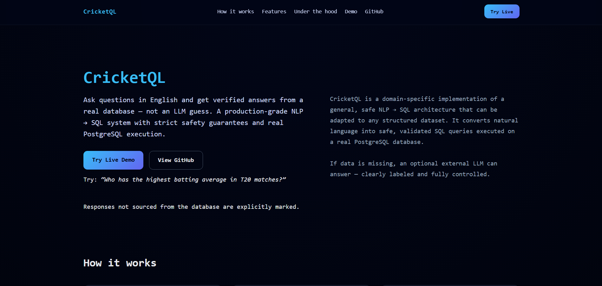
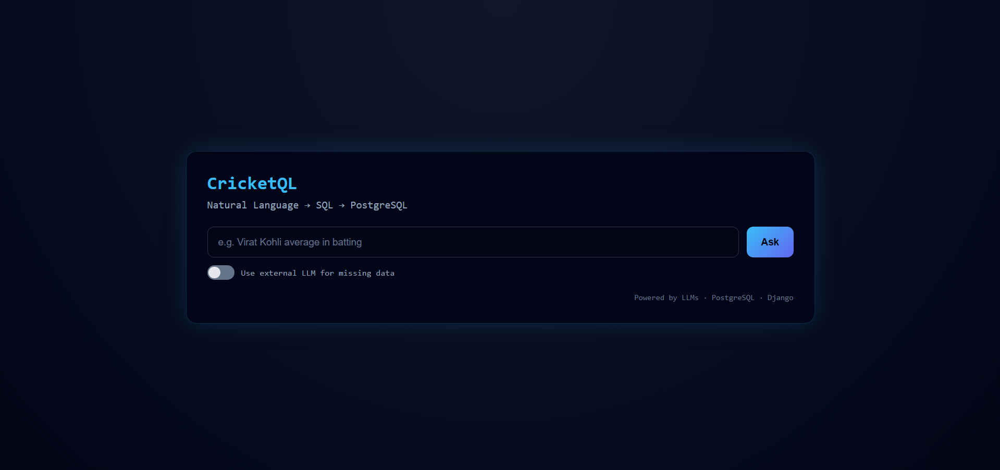

# 🏏 CricketQL

**CricketQL** is a **Natural Language → SQL** system that allows users to query cricket statistics using plain English.

Unlike LLM-only chat systems, CricketQL executes queries against a **real PostgreSQL database** with validation, safety guardrails, and intelligent caching — ensuring **accurate, deterministic results** instead of hallucinated answers.

---

## 🚀 One-Command Setup (Recommended)

Run the entire system locally using Docker:

```bash
docker compose up
```

This automatically starts:

✅ Django API server

✅ PostgreSQL database

✅ Redis caching layer

✅ Database migrations

✅ Automatic dataset loading

No manual installation of Python, PostgreSQL, or Redis is required.

Open in browser:

http://localhost:8000

## 🧠 Architecture Overview
User Query
     ↓
LLM SQL Generator
     ↓
Validation Layer (Safety Guardrails)
     ↓
PostgreSQL Database
     ↑
Redis Cache (SQL Templates)

## 🔄 Query Flow

User submits a natural language question

Query is normalized and parsed (metric + entity extraction)

Redis cache checked for existing SQL template

LLM generates SQL only on cache miss

SQL validated (SELECT-only enforcement)

PostgreSQL executes query

Structured results returned to the UI

## ⚙️ Tech Stack

Python

Django

PostgreSQL

Redis (Query Caching)

Docker & Docker Compose

HTML / CSS / JavaScript

LLMs via Groq API (with optional fallback)

## ✨ Features

Natural language → SQL translation

Redis-based query caching (reduces LLM calls)

Safe SQL execution (read-only enforcement)

Schema-aware query generation

Graceful handling of unsupported queries

Optional fallback LLM responses

Containerized multi-service architecture

Automatic database initialization

## 💬 Example Queries

"Total runs scored by Virat Kohli"

"Top 5 players by strike rate"

"Malinga bowling average"

"Dhoni dismissals per innings"

## 🛠 Manual Setup (Without Docker)

If you prefer running locally:

1️⃣ Clone the repository
git clone <repo-url>
2️⃣ Create a .env file
PRIMARY_API_KEY=your_key
FALLBACK_API_KEY=your_key
3️⃣ Install dependencies
pip install -r requirements.txt
4️⃣ Configure PostgreSQL locally

Update database credentials in settings.py.

5️⃣ Run migrations
python manage.py migrate
6️⃣ Load dataset
python manage.py load_data
7️⃣ Start server
python manage.py runserver
⚠️ Disclaimer

This project uses demo cricket statistics data for educational purposes.
API keys and credentials are not included.


## Project Preview



